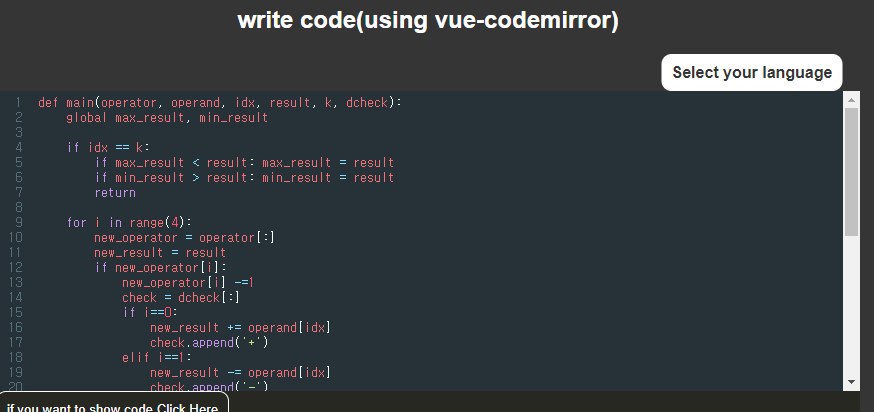

# Vue-Codemirror

[toc]

## Project Img

> white mode && Dark mode


## Mode 전환

> `css`의 `:root`를 사용하여 모드변환

``` css
/* App.vue */ 
:root {
  --mode-color: black;
  --mode-back-color: ivory;
  --mode-box-shadow: rgba(0, 0, 0, 0.623);
  --mode-editor-color: rgba(230, 224, 224, 0.719);
}
```

``` javascript
// ModeBtn.vue
methods:{
        chageMode:function(){
            const checkbox = document.querySelector('#changeMode')
            const label =  document.querySelector("label")
            if (checkbox.checked){
                this.modeState = "Dark mode"
                label.style.backgroundColor = "white"
                document.documentElement.style.setProperty("--mode-color","white")
                document.documentElement.style.setProperty("--mode-back-color","rgb(54, 53, 53)")
                document.documentElement.style.setProperty("--mode-box-shadow","white")
                document.documentElement.style.setProperty("--mode-editor-color","rgba(165, 165, 165, 0.479)")
            } else {
                this.modeState = "White mode"
                label.style.backgroundColor = "black"
                document.documentElement.style.setProperty("--mode-color","black")
                document.documentElement.style.setProperty("--mode-back-color","ivory")
                document.documentElement.style.setProperty("--mode-box-shadow","rgba(0, 0, 0, 0.623)")
                document.documentElement.style.setProperty("--mode-editor-color","rgba(230, 224, 224, 0.719)")
            }
        }
    }
```


## Markdown

> 사용자들이 코드를 입력하고 이를 보여주기 위하여 처음으로 `Markdown` 을 선택.
>
> 왼쪽`textarea`의 값을 `marked`를 사용하여 `html` 방식으로 보여주었다. -> 입력창과 출력창이 나누어져있음으로 탈락.


## Code-Highlight

> `code-hightlight`에 작성을 할 수 없음으로 탈락.


``` javascript
//html
<code-highlight language="javascript">
    {{input}}
</code-highlight>  


// script
import CodeHighlight from "vue-code-highlight/src/CodeHighlight.vue"
import "vue-code-highlight/themes/prism-okaidia.css"

export default {
    components:{
        CodeHighlight
    }
}

```


## CodeMirror

> good! `v-model` 을 통해 입력받은 값을 `code-highlight`에 넣었을 때도 잘 작동 되었다. 




## Project setup
```
npm install
```

### Compiles and hot-reloads for development
```
npm run serve
```

### Personally installed
```
npm install lodash
npm install marked --save-dev
npm install vue-code-highlight --save
npm install vue-codemirror --save
```


### Customize configuration
See [Configuration Reference](https://cli.vuejs.org/config/).
